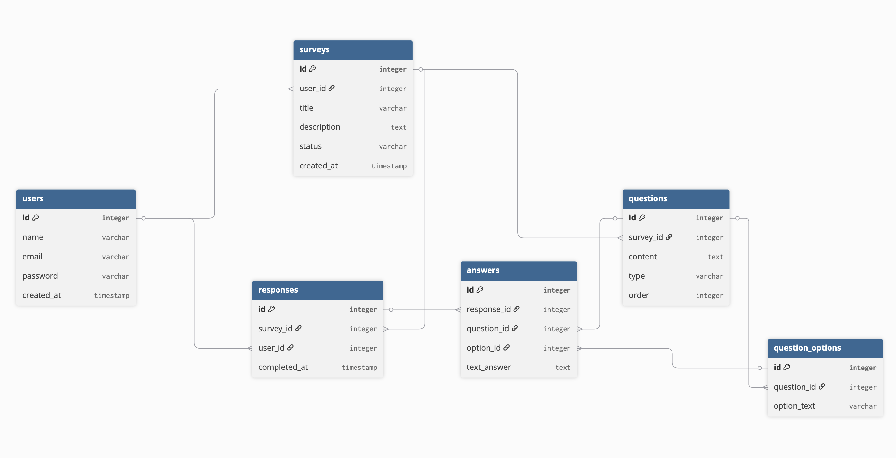

# Преддипломная практика. 

Проект: API сервиса опросов и голосований (Survey API)

---

## Список эндпоинтов

Блок: Авторизация (Auth)

| метод | URL           | Описание                                             |
| ----- | ------------- | ---------------------------------------------------- |
| POST  | /api/register | Регистрация нового пользователя (имя, email, пароль) |
| POST  | /api/login    | Вход. Сервер проверяет пароль и выдает JWT токен.    |

Блок: Управление опросами (Для Авторов)

| метод | URL                         | Описание                                            |
| ----- | --------------------------- | --------------------------------------------------- |
| GET   | /api/my-surveys             | Показать все опросы, которые создал текущий юзер.   |
| POST  | /api/surveys                | Создать пустой опрос (название, описание).          |
| POST  | /api/surveys/{id}/questions | Добавить вопрос к опросу №{id}.                     |
| PATCH | /api/surveys/{id}/publish   | Опубликовать опрос (после этого его нельзя менять). |

Блок: Прохождение и Статистика (Для Респондентов и Авторов)

| метод | URL                         | Описание                                                             |
| ----- | --------------------------- | -------------------------------------------------------------------- |
| GET   | /api/surveys                | Показать список всех активных (опубликованных) опросов.              |
| GET   | /api/surveys/{id}           | Получить опрос со всеми вопросами и вариантамиответов.               |
| POST  | /api/surveys/{id}/responses | Главное действие: отправить ответы на опрос.                         |
| GET   | /api/surveys/{id}/stats     | Показать результаты: сколько людей прошли, какие проценты у ответов. |

---

## Стек

- **PHP** — Laravel

База данных: MySQL.

---

## ER диаграмма базы данных

Как работает твоя БД:

Кто создал? (users → surveys)
Юзер создает запись в surveys. В поле user_id записывается его ID. Это связь «Один ко многим»: один юзер может создать много опросов.

Что внутри опроса? (surveys → questions → question_options)
В таблице questions лежат сами вопросы («Как вам наш сервис?», «Ваш пол?»). Если вопрос подразумевает выбор (одиночный или множественный), то варианты («Хорошо/Плохо», «М/Ж») лежат в question_options.

Кто и когда зашел? (responses)
Это ключевая таблица. Когда респондент нажимает кнопку «Начать опрос», создается запись в responses. Она фиксирует: «Юзер Вася начал Опрос №5 в 12:00».

Зачем это нужно? Чтобы выполнить требование ТЗ: "Один респондент может пройти один опрос только один раз". Перед началом мы просто проверяем: есть ли уже в этой таблице пара user_id + survey_id.

Что именно ответил? (responses → answers)
Когда Вася отправляет опрос, в таблицу answers сыплются его ответы. Каждая строчка ссылается на responses_id (конкретную сессию Васи).

Если вопрос с выбором — заполняется option_id.

Если вопрос текстовый — заполняется text_answer.

Table users {
  id integer [primary key]
  name varchar
  email varchar
  password varchar
  created_at timestamp
}

Table surveys {
  id integer [primary key]
  user_id integer [ref: > users.id]
  title varchar
  description text
  status varchar
  created_at timestamp
}

Table questions {
  id integer [primary key]
  survey_id integer [ref: > surveys.id]
  content text
  type varchar
  order integer
}

Table question_options {
  id integer [primary key]
  question_id integer [ref: > questions.id]
  option_text varchar
}

Table responses {
  id integer [primary key]
  survey_id integer [ref: > surveys.id]
  user_id integer [ref: > users.id]
  completed_at timestamp
}

Table answers {
  id integer [primary key]
  response_id integer [ref: > responses.id]
  question_id integer [ref: > questions.id]
  option_id integer [ref: > question_options.id, null]
  text_answer text [null]
}

- **dbdiagram.io** https://dbdiagram.io

## Инструкция по развертыванию

### 1. Клонирование репозитория
Откройте терминал и выполните:

git clone [https://github.com/temaniall/practice-backend-2026.git](https://github.com/temaniall/practice-backend-2026.git)
cd practice-backend-2026

### 2. Подготовка окружения (в папке src)

Перейдите в директорию с кодом и установите зависимости:

cd src
composer install
cp .env.example .env
php artisan key:generate

### 3. Настройка базы данных

Убедитесь, что ваш локальный MySQL запущен. Отредактируйте файл src/.env, указав параметры подключения:

DB_CONNECTION=mysql
DB_HOST=127.0.0.1
DB_PORT=3306
DB_DATABASE=survey
DB_USERNAME=root
DB_PASSWORD=ваш_пароль_если_есть

### 4. Работа с базой данных

Запуск MySQL

Если сервер не запущен, используйте команду:

brew services start mysql

### 5. Создание и проверка базы

Войдите в консоль MySQL:

mysql -u root -p

Создайте базу данных (если еще не создана):

CREATE DATABASE IF NOT EXISTS survey;
SHOW DATABASES; -- Убедиться, что база появилась в списке

### 6. Применение миграций

Выполните миграции, чтобы создать структуру таблиц:

php artisan migrate

### 7. Проверка наличия таблиц

Чтобы убедиться, что все 6 таблиц (surveys, questions и др.) созданы, выполните в консоли MySQL:

USE survey;
SHOW TABLES;

### 8. Запуск приложения

php artisan serve

Приложение будет доступно по адресу: http://127.0.0.1:8000